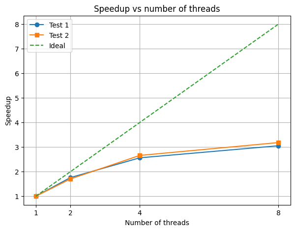

# OpenMP

## 1. Постановка задачи

**Дано:** три концентрических эллипсоида:

- Эллипсоиды имеют полуоси a, b, c и общий центр (0,0,0)
- Первый эллипсоид E1 — слой brain
- Второй эллипсоид E2 — слой skull
- Третий эллипсоид E3 — слой skin
- Внешний слой — outside

## 2. Цель

Построить трёхмерную сетку, поделив пространство вокруг внешнего эллипсоида на маленькие параллелепипеды (элементы), и для каждого элемента определить: долю объёма, занимаемого каждым слоем (brain, skull, skin, outside).

## 3. Метод оценки объёма: Монте-Карло

- Для каждого элемента генерируются `Nsamples` случайных точек внутри него.
- Каждая точка проверяется, в какой слой она попадает.
- Доля точек в каждом слое = приближённая доля объёма слоя в элементе.

## 4. Распараллеливание с OpenMP

- С помощью `#pragma omp parallel` создаётся группа потоков.
- `#pragma omp for collapse(3) schedule(dynamic)` — объединение 3 вложенных циклов и распределение итераций между потоками.
- Используется `#pragma omp critical` для безопасного доступа к файлу, чтобы потоки не писали одновременно.

## 5. Вывод результатов в файл `result.txt`

Каждая строка:
i j k brain skull skin outside
где `(i,j,k)` — положение элемента, а `brain/skull/skin/outside` — доля объёма слоя в элементе `(i,j,k)` от объёма элемента.

---

### Параметры в функции `main()`

- В качестве тестовых случаев рассмотрены слудующие примеры:
1. Три концентрических эллипсоида:  
  - Brain: E1 {30.0, 40.0, 50.0}  
  - Skull: E2 {35, 45, 55}  
  - Skin: E3 {40, 50, 60} 
2. Три концентрических эллипсоида:  
  - Brain: E1 {30.0, 40.0, 50.0}  
  - Skull: E2 {30.5, 40.5, 50.5}  
  - Skin: E3 {31.0, 41.0, 51.0}  
- Делим минимальный параллелепипед, который содержит все слои, на 32×32×32 элемента (`Nx`, `Ny`, `Nz`).
- Количество случайных точек в одном элементе: `Nsamples = 2048`.

Экспериментальные результаты показывают, что распараллеливание позволяет сократить время вычислений. 
| Number of threads | 1       | 2       | 4       | 8       |
|-------------------|---------|---------|---------|---------|
| Test 1(sec.)      | 732.348 | 416.443 | 285.819 | 239.889 |
| Test 2(sec.)      | 698.445 | 409.999 | 262.634 | 219.477 |

График ускорения в зависимости от числа потоков:

